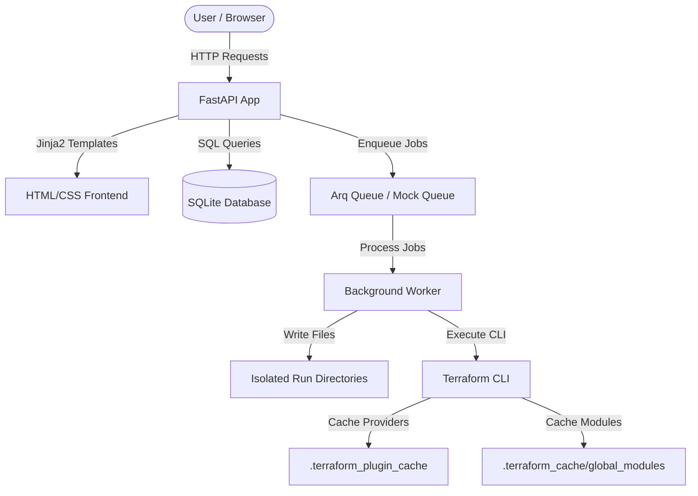

# Project Architecture & Deep-Dive Documentation

This document provides a comprehensive, deep-dive explanation of the **Terraform Engine** project. It is designed to help you understand the project from the very start, covering the role of each directory, file, data model, API endpoint, worker logic, and caching strategy.

---

## 1. High-Level System Architecture

The Terraform Engine is a premium, lightweight, self-hosted infrastructure orchestrator. It allows teams to register Terraform templates (Tasks) and deploy them (Deployments) asynchronously.

The core architecture consists of:
1. **FastAPI Web Application**: Serves the REST API and the responsive Jinja2-based HTML frontend.
2. **SQLAlchemy + SQLite Database**: Stores the catalog of Tasks and the lifecycle state of all Deployments.
3. **Arq Background Worker (Redis)**: An asynchronous queuing worker that executes Terraform CLI commands (init, apply, destroy) in isolated local run directories. In the absence of a running Redis server, it seamlessly falls back to an in-process asynchronous task scheduler (`MockArqRedis`).
4. **Terraform CLI**: The local execution engine for provisioning infrastructure.
5. **Two-Tier Caching System**: Optimizes initialization times by caching provider plugins globally and sharing downloaded remote modules across tasks.

---

## 2. Directory and File Layout

Here is the role of each folder, file, and utility in the workspace:

### 📂 app/ (Core Application Package)
Contains the FastAPI application modules:
*   **[app/main.py](file:///x:/Onedrive/Desktop/New%20folder/app/main.py)**: The entry point of the entire application. It initializes FastAPI, mounts static assets, and registers all router endpoints.
*   **[app/worker.py](file:///x:/Onedrive/Desktop/New%20folder/app/worker.py)**: The background execution runner. It executes `terraform init`, `terraform apply`, and `terraform destroy` in subfolders, captures standard outputs in real-time, updates database states, and manages caching.
*   **📂 app/core/**: Reusable application-level core configurations and pools.
    *   **[app/core/config.py](file:///x:/Onedrive/Desktop/New%20folder/app/core/config.py)**: Handles system environments, variables, settings, and folder creations.
    *   **[app/core/database.py](file:///x:/Onedrive/Desktop/New%20folder/app/core/database.py)**: Establishes the SQLAlchemy engine, configures `SessionLocal`, and exports the `get_db()` session generator.
    *   **[app/core/auth.py](file:///x:/Onedrive/Desktop/New%20folder/app/core/auth.py)**: Implements lightweight security headers (`X-Admin-Token` for admin-only endpoints, and `X-User-Id` for user identification).
    *   **[app/core/queue.py](file:///x:/Onedrive/Desktop/New%20folder/app/core/queue.py)**: Manages Redis-backed connection pooling for `arq` with mock in-process fallback.
*   **📂 app/models/**: SQLAlchemy models defining table structures.
    *   **[app/models/task.py](file:///x:/Onedrive/Desktop/New%20folder/app/models/task.py)**: Table structure for task templates.
    *   **[app/models/deployment.py](file:///x:/Onedrive/Desktop/New%20folder/app/models/deployment.py)**: Table structure for deployments and deployment status enum.
*   **📂 app/schemas/**: Pydantic models for data validations and endpoint serializations.
    *   **[app/schemas/task.py](file:///x:/Onedrive/Desktop/New%20folder/app/schemas/task.py)**: Serialization schemas for Task data.
    *   **[app/schemas/deployment.py](file:///x:/Onedrive/Desktop/New%20folder/app/schemas/deployment.py)**: Serialization schemas for Deployment inputs and results.
*   **📂 app/api/**: API endpoint router definitions.
    *   **[app/api/admin.py](file:///x:/Onedrive/Desktop/New%20folder/app/api/admin.py)**: Router for task administration (registering/deleting).
    *   **[app/api/tasks.py](file:///x:/Onedrive/Desktop/New%20folder/app/api/tasks.py)**: Router for query tasks metadata.
    *   **[app/api/deployments.py](file:///x:/Onedrive/Desktop/New%20folder/app/api/deployments.py)**: Router for provisioning and deployments lifecycles.
*   **📂 app/frontend/**: Router and templates for the UI dashboard.
    *   **[app/frontend/router.py](file:///x:/Onedrive/Desktop/New%20folder/app/frontend/router.py)**: Serving Jinja2 HTML responses.
*   **📂 app/templates/**: Responsive HTML pages using layout inheritance.
*   **📂 app/static/**: CSS styling sheets.

### 📂 tests/ (Automated Test Suite)
*   **[tests/conftest.py](file:///x:/Onedrive/Desktop/New%20folder/tests/conftest.py)**: Pytest configurations, database mocks, override dependency bindings.
*   **[tests/test_tasks.py](file:///x:/Onedrive/Desktop/New%20folder/tests/test_tasks.py)**: Tests targeting admin and template queries.
*   **[tests/test_deployments.py](file:///x:/Onedrive/Desktop/New%20folder/tests/test_deployments.py)**: Tests targeting deployments lifecycle operations.

### 📂 task_scripts/ (Task File Storage)
*   Stores the catalog templates uploaded via the UI.
*   Each task gets its own subfolder: `task_scripts/{task_name}/`.

### 📂 deployments_runs/ (Execution Sandboxes)
*   Temporary sandboxes created dynamically on each run: `deployments_runs/{deployment_id}/`.

---

## 3. Database Schema Models

We maintain two primary tables in SQLite:

### `tasks` Table
Maps to the `Task` ORM class in `app/models/task.py`:
*   `task_name` (String, Primary Key): Unique url-friendly identifier.
*   `display_name` (String): Human-friendly name.
*   `description` (String, Optional): Explanation of the template.
*   `input_schema` (JSON): Draft-7 JSON schema defining expected input properties.
*   `module_source` (String): Disk path pointing to `task_scripts/{task_name}/`.
*   `module_version` (String, Optional) & `category` & `provider`.
*   `created_at` / `updated_at` (DateTime).

### `deployments` Table
Maps to the `Deployment` ORM class in `app/models/deployment.py`:
*   `deployment_id` (String, Primary Key): UUID identifier.
*   `deployment_name` (String): Name of the environment instance.
*   `task_name` (String): Reference to the Task that generated this deployment.
*   `owner_id` (String): Reference to the user who deployed the resource.
*   `status` (Enum): `PENDING`, `PROVISIONING`, `ACTIVE`, `UPDATING`, `DESTROYING`, `DESTROYED`, `FAILED`.
*   `state_path` (String, Optional): Resolved path on disk pointing to `terraform.tfstate`.
*   `current_inputs` (JSON): The parameters values used to deploy the resources.
*   `outputs` (JSON, Optional): Key-value outputs extracted from the state file.
*   `last_error` (String, Optional): Stack trace or execution error message in case of failure.
*   `created_at` / `updated_at` (DateTime).

---

## 4. Workflows & Lifecycle States

### Create / Provision Workflow
1. Client submits inputs to `POST /api/provision/{task_name}`.
2. The input payload is validated against the task's JSON schema.
3. A new `Deployment` record is created in the database with status `PENDING`.
4. A Redis job `run_terraform_create` is enqueued, and the status changes to `PROVISIONING`.
5. The worker sets up `deployments_runs/{deployment_id}/`, copies task scripts, and writes inputs into `terraform.tfvars.json`.
6. Cache folders (`.terraform`) are restored to the folder.
7. The worker runs `terraform init`, followed by `terraform apply -auto-approve`.
8. Once completed, the outputs are fetched via `terraform output -json`, state is saved, and status becomes `ACTIVE`.

### Update / Patch Workflow
1. Client submits partial inputs to `PATCH /api/deployments/{deployment_id}`.
2. The payload is merged with the existing inputs and validated against the schema.
3. The DB status is updated to `UPDATING`.
4. A Redis job `run_terraform_update` is enqueued.
5. The worker updates the `terraform.tfvars.json` in the existing deployment folder.
6. The worker runs `terraform init` and `terraform apply -auto-approve` to update resources in-place.
7. DB status is set back to `ACTIVE`, and new outputs are stored.

### Teardown / Destroy Workflow
1. Client submits `DELETE /api/deployments/{deployment_id}`.
2. DB status becomes `DESTROYING`.
3. A Redis job `run_terraform_destroy` is enqueued.
4. The worker runs `terraform destroy -auto-approve` inside `deployments_runs/{deployment_id}/`.
5. Once completed, the directory is deleted, and the DB row is removed.

---

## 5. Advanced Caching Strategy

To speed up `terraform init` (which usually downloads provider binaries and modules on each run), the project uses a two-tier caching strategy:

### A. Provider Cache (Global)
*   Configured via `env["TF_PLUGIN_CACHE_DIR"] = str(Path("./.terraform_plugin_cache").resolve())`.
*   This causes Terraform to cache all provider binaries (e.g. AWS or Azure plugins) in a central workspace directory, sharing them globally across *all* runs.

### B. Module Cache (Two-Tiered)
1.  **Task-Level Cache**: We dynamically identify the task's script source folder (`task_scripts/{task_name}`). When a run finishes, we copy `.terraform/` and `.terraform.lock.hcl` back into the task's source folder. The next run will copy it directly, making the initialization near-instantaneous.
2.  **Global Module Cache**: We maintain a global module cache directory at `.terraform_cache/global_modules/`. When a run completes, we copy newly downloaded modules into this global folder and merge the metadata inside `modules.json`. If a task-level cache is not present (e.g. first run of a new task), it loads cached modules from the global store, eliminating network downloads.

---

## 6. Endpoints Summary

| Endpoint | Method | Role | Protection |
| :--- | :--- | :--- | :--- |
| `/` | `GET` | HTML dashboard view | Public |
| `/tasks/new` | `GET` | HTML new task registration view | Public |
| `/deployments/{id}` | `GET` | HTML deployment details view | Public |
| `/api/admin/tasks` | `POST` | Registers a task (multipart upload) | Admin Header |
| `/api/admin/tasks/{name}` | `DELETE` | Removes task and all deployments | Admin Header |
| `/api/tasks` | `GET` | Lists all registered tasks | Public |
| `/api/tasks/{name}` | `GET` | Returns single task info | Public |
| `/api/provision/{name}` | `POST` | Provisions new deployment | User Header |
| `/api/deployments` | `GET` | Lists user's deployments | User Header |
| `/api/deployments/{id}` | `GET` | Returns single deployment details | User Header |
| `/api/deployments/{id}` | `PATCH` | Updates input parameters and redeploys | User Header |
| `/api/deployments/{id}` | `DELETE` | Destroys deployment resources | User Header |
