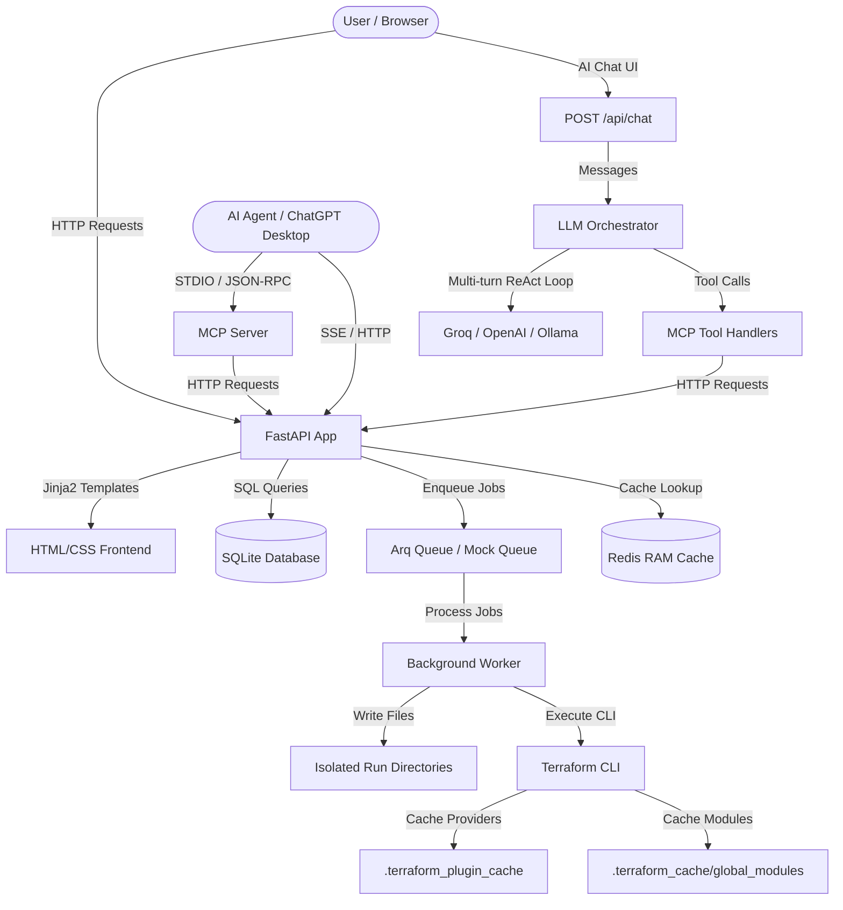

# Project Architecture & Deep-Dive Documentation

This document provides a comprehensive, deep-dive explanation of the **Terraform Engine** project. It is designed to help you understand the project from the very start, covering the role of each directory, file, data model, API endpoint, worker logic, caching strategy, AI orchestration, and operational guardrails.

---

## 1. High-Level System Architecture

The Terraform Engine is a premium, lightweight, self-hosted infrastructure orchestrator with an integrated AI Chat Interface. It allows teams to register Terraform templates (Tasks), deploy them (Deployments) asynchronously, and manage everything through a conversational AI assistant or a REST API.

The core architecture consists of:
1. **FastAPI Web Application**: Serves the REST API, the AI Chat endpoint, and the responsive Jinja2-based HTML frontend.
2. **SQLAlchemy + SQLite Database**: Stores the catalog of Tasks and the lifecycle state of all Deployments.
3. **Arq Background Worker (Redis)**: An asynchronous queuing worker that executes Terraform CLI commands (init, apply, destroy) in isolated local run directories. In the absence of a running Redis server, it seamlessly falls back to an in-process asynchronous task scheduler (`MockArqRedis`).
4. **Terraform CLI**: The local execution engine for provisioning infrastructure.
5. **Two-Tier Caching System**: Optimizes initialization times by caching provider plugins globally and sharing downloaded remote modules across tasks.
6. **Model Context Protocol (MCP) Server**: Exposes API endpoints as structured tools to local and remote AI Agents.
7. **LLM Orchestrator**: A multi-turn ReAct tool-calling loop that connects the AI Chat to MCP tools, enforced by 11 strict operational guardrails.
8. **History Manager**: Token-optimized sliding-window pruning and tool-result compression for low-TPM/free-tier LLM APIs.
9. **Redis Catalog Cache**: Real-time category and provider metadata cached in Redis RAM for zero-latency system prompt construction.



---

## 2. Directory and File Layout

Here is the role of each folder, file, and utility in the workspace:

### 📂 app/ (Core Application Package)
Contains the FastAPI application modules:
*   **app/main.py**: The entry point of the entire application. It initializes FastAPI, mounts static assets, and registers all router endpoints including the chat API.
*   **app/worker.py**: The background execution runner. It executes `terraform init`, `terraform apply`, and `terraform destroy` in subfolders, captures standard outputs in real-time, updates database states, and manages caching.
*   **app/mcp_server.py**: The Model Context Protocol (MCP) server script. Integrates the API with LLMs by wrapping tasks and deployments as tools. Includes MCP Resources for catalog metadata.
*   **📂 app/agent/**: Deterministic FSM AI orchestrator.
    *   **app/agent/state.py**: Session-scoped Redis conversation state storage (`ConversationState`), supporting load, save, and clear operations with TTL.
    *   **app/agent/llm_client.py**: Thin Groq / OpenAI / Custom chat completions wrapper handling single-purpose LLM calls, JSON mode validation, single-retry fallback, and timeout exception wrapping.
    *   **app/agent/nodes.py**: State machine nodes (`classify_intent`, `handle_chitchat`, `handle_list`, `handle_status`, `handle_provision`, `handle_destroy`) enforcing operational guardrails in pure Python.
    *   **app/agent/orchestrator.py**: Single entry point `handle_turn()` managing session state, mid-flow topic switching, intent routing, and node execution.
*   **📂 app/core/**: Reusable application-level core configurations, database models, and queue management.
    *   **app/core/config.py**: Handles system environments, variables, settings, and folder creations.
    *   **app/core/database.py**: Establishes the SQLAlchemy engine, configures `SessionLocal`, and exports the `get_db()` session generator.
    *   **app/core/auth.py**: Implements lightweight security headers (`X-Admin-Token` for admin-only endpoints, and `X-User-Id` for user identification).
    *   **app/core/queue.py**: Manages Redis-backed connection pooling for `arq` with key-value helpers and mock fallback.
*   **📂 app/models/**: SQLAlchemy models defining table structures.
    *   **app/models/task.py**: Table structure for task templates.
    *   **app/models/deployment.py**: Table structure for deployments and deployment status enum.
*   **📂 app/schemas/**: Pydantic models for data validations and endpoint serializations.
    *   **app/schemas/task.py**: Serialization schemas for Task data.
    *   **app/schemas/deployment.py**: Serialization schemas for Deployment inputs and results.
*   **📂 app/api/**: API endpoint router definitions.
    *   **app/api/admin.py**: Router for task administration (registering/deleting).
    *   **app/api/tasks.py**: Router for querying tasks metadata with distinct category/provider endpoints and Redis caching.
    *   **app/api/deployments.py**: Router for provisioning and deployment lifecycles, including cross-user lookups, dependency-safe deletion, and impact analysis.
    *   **app/api/chat.py**: Router for the AI Chat endpoint (`POST /api/chat`). Accepts multi-turn conversation messages and delegates to `app.agent.orchestrator.handle_turn()`.

*   **📂 app/frontend/**: Router and templates for the UI dashboard.
    *   **app/frontend/router.py**: Serving Jinja2 HTML responses.
*   **📂 app/templates/**: Responsive HTML pages using layout inheritance.
    *   **chat.html**: The AI Chat Interface — a glassmorphic conversational UI with provider/model selection, API key input, and real-time tool execution trace rendering.
*   **📂 app/static/**: CSS styling sheets.

### 📂 tests/ (Automated Test Suite)
*   **tests/conftest.py**: Pytest configurations, database mocks, override dependency bindings.
*   **tests/test_tasks.py**: Tests targeting admin and template queries.
*   **tests/test_deployments.py**: Tests targeting deployment lifecycle operations including dependency blocking verification.

### 📂 task_scripts/ (Task File Storage)
*   Stores the catalog templates uploaded via the UI.
*   Each task gets its own subfolder: `task_scripts/{task_name}/`.

### 📂 deployments_runs/ (Execution Sandboxes)
*   Temporary sandboxes created dynamically on each run: `deployments_runs/{deployment_id}/`.

---

## 3. Database Schema Models

We maintain two primary tables in SQLite:

### `tasks` Table
Maps to the `Task` ORM class in `app/models/task.py`:
*   `task_name` (String, Primary Key): Unique url-friendly identifier.
*   `display_name` (String): Human-friendly name.
*   `description` (String, Optional): Explanation of the template.
*   `input_schema` (JSON): Draft-7 JSON schema defining expected input properties.
*   `module_source` (String): Disk path pointing to `task_scripts/{task_name}/`.
*   `module_version` (String, Optional) & `category` & `provider`.
*   `created_at` / `updated_at` (DateTime).

### `deployments` Table
Maps to the `Deployment` ORM class in `app/models/deployment.py`:
*   `deployment_id` (String, Primary Key): UUID identifier.
*   `deployment_name` (String): Name of the environment instance. **Unique per user (`owner_id`)**, enforced at the API level.
*   `task_name` (String): Reference to the Task that generated this deployment.
*   `owner_id` (String): Reference to the user who deployed the resource.
*   `status` (Enum): `PENDING`, `PROVISIONING`, `ACTIVE`, `UPDATING`, `DESTROYING`, `DESTROYED`, `FAILED`.
*   `state_path` (String, Optional): Resolved path on disk pointing to `terraform.tfstate`.
*   `current_inputs` (JSON): The parameter values used to deploy the resources.
*   `outputs` (JSON, Optional): Key-value outputs extracted from the Terraform state file (e.g., `subnet_id`, `vnet_id`). Used by the dependency detection system to identify cross-deployment resource references.
*   `last_error` (String, Optional): Stack trace or execution error message in case of failure.
*   `created_at` / `updated_at` (DateTime).

---

## 4. Workflows & Lifecycle States

### Create / Provision Workflow
1. Client submits inputs to `POST /api/provision/{task_name}`.
2. The input payload is validated against the task's JSON schema.
3. Duplicate deployment name check is enforced per user (`owner_id`).
4. A new `Deployment` record is created in the database with status `PENDING`.
5. A Redis job `run_terraform_create` is enqueued, and the status changes to `PROVISIONING`.
6. The worker sets up `deployments_runs/{deployment_id}/`, copies task scripts, and writes inputs into `terraform.tfvars.json`.
7. Cache folders (`.terraform`) are restored to the folder.
8. The worker runs `terraform init`, followed by `terraform apply -auto-approve`.
9. Once completed, the outputs are fetched via `terraform output -json`, state is saved, and status becomes `ACTIVE`.

### Update / Patch Workflow
1. Client submits partial inputs to `PATCH /api/deployments/{deployment_id}` or `PATCH /api/deployments/name/{deployment_name}`.
2. The payload is merged with the existing inputs and validated against the schema.
3. The DB status is updated to `UPDATING`.
4. A Redis job `run_terraform_update` is enqueued.
5. The worker updates the `terraform.tfvars.json` in the existing deployment folder.
6. The worker runs `terraform init` and `terraform apply -auto-approve` to update resources in-place.
7. DB status is set back to `ACTIVE`, and new outputs are stored.

### Teardown / Destroy Workflow
1. Client submits `DELETE /api/deployments/{deployment_id}` or `DELETE /api/deployments/name/{deployment_name}`.
2. **Dependency Check**: The system inspects all active deployments globally (across all users) to verify if any child deployment's `current_inputs` reference the target deployment's `deployment_name` or `outputs` values. If dependencies exist, the request is rejected with **HTTP 409 Conflict** and a list of dependent deployment names.
3. DB status becomes `DESTROYING`.
4. A Redis job `run_terraform_destroy` is enqueued.
5. The worker runs `terraform destroy -auto-approve` inside `deployments_runs/{deployment_id}/`.
6. Once completed, the directory is deleted, and the DB row is removed.

---

## 5. Dependency-Safe Deletion & Impact Analysis

The system implements **Strict Dependency Blocking** to prevent accidental destruction of parent resources when child deployments rely on them.

### How It Works

The `find_dependent_deployments()` function in `app/api/deployments.py`:

1. **Builds reference tokens** from the target deployment:
   - The deployment's `deployment_name` (catches deployments that reference the parent by name).
   - Values from the deployment's `outputs` (catches deployments that use actual cloud resource IDs like `subnet_id`, `vnet_id`).
   - Does **NOT** include generic `current_inputs` values (like `location: "eastus"`) to avoid false positives.

2. **Scans globally** across all active deployments (all users, `status != DESTROYED`).

3. **Matches** any other deployment whose `current_inputs` values overlap with the reference tokens.

4. **Returns HTTP 409 Conflict** with the list of dependent deployments if matches are found.

### Example

```
Deleting: deployment "my-subnet" (outputs: {subnet_id: "/subs/.../test"})
    ↓
Scan: deployment "asad-vm" has current_inputs.subnet_id = "/subs/.../test"
    ↓
Result: HTTP 409 — "Deletion blocked: active dependent deployments exist (asad-vm)"
```

---

## 6. Advanced Caching Strategy

To speed up `terraform init` (which usually downloads provider binaries and modules on each run), the project uses a two-tier caching strategy:

### A. Provider Cache (Global)
*   Configured via `env["TF_PLUGIN_CACHE_DIR"] = str(Path("./.terraform_plugin_cache").resolve())`.
*   This causes Terraform to cache all provider binaries (e.g. AWS or Azure plugins) in a central workspace directory, sharing them globally across *all* runs.

### B. Module Cache (Two-Tiered)
1.  **Task-Level Cache**: We dynamically identify the task's script source folder (`task_scripts/{task_name}`). When a run finishes, we copy `.terraform/` and `.terraform.lock.hcl` back into the task's source folder. The next run will copy it directly, making the initialization near-instantaneous.
2.  **Global Module Cache**: We maintain a global module cache directory at `.terraform_cache/global_modules/`. When a run completes, we copy newly downloaded modules into this global folder and merge the metadata inside `modules.json`. If a task-level cache is not present (e.g. first run of a new task), it loads cached modules from the global store, eliminating network downloads.

---

## 7. AI Chat & FSM Orchestrator

### Architecture

The AI Chat system consists of three main components in `app/agent/`:

1. **Chat Endpoint** (`app/api/chat.py`): Accepts `POST /api/chat` requests with multi-turn conversation messages and optional `X-Session-Id` header.
2. **Deterministic FSM Orchestrator** (`app/agent/orchestrator.py`): Manages control flow in pure Python, intent classification, mid-flow topic switching, and state node dispatching.
3. **Redis State Manager** (`app/agent/state.py`): Persists session-scoped `ConversationState` in Redis (30-minute TTL).


### Supported LLM Providers

| Provider | Base URL | Default Model |
| :--- | :--- | :--- |
| **Groq** | `https://api.groq.com/openai/v1` | `llama-3.3-70b-versatile` |
| **OpenAI** | `https://api.openai.com/v1` | `gpt-4o-mini` |
| **Custom/On-Prem** | Configurable (e.g. `http://localhost:11434/v1`) | `llama3.3` |

### Dynamic System Prompt

The system prompt is dynamically constructed at runtime via `build_dynamic_context()`:
- **Category & Provider Metadata**: Fetched from Redis RAM cache (0ms latency) or falls back to database query.
- **MCP Tool Definitions**: Cloned and enriched with real-time parameter description hints from Redis.

### Tool Definitions (MCP Tools)

The orchestrator exposes 6 tools to the LLM:

| Tool | Type | Description |
| :--- | :--- | :--- |
| `list_tasks` | Read-Only | List available Terraform tasks, optionally filtered by category/provider |
| `get_task_schema` | Read-Only | Get metadata and input JSON schema for a task |
| `provision_task` | Modifying | Enqueue background provisioning of a task |
| `get_deployment_status` | Read-Only | Inspect deployment status, inputs, and outputs |
| `list_deployments` | Read-Only | List all deployments, optionally filtered by status |
| `destroy_deployment` | Modifying | Initiate Terraform teardown of a deployment |

### 11 Strict Operational Guardrails

| # | Guardrail | Purpose |
| :--- | :--- | :--- |
| 1 | **Greetings & General Prompts** | Prevents tool calls on casual greetings; guides user to explore categories/providers |
| 2 | **Specific Task Catalog Inquiries** | Triggers `list_tasks` with filters; includes fallback retry without filters on empty results |
| 3 | **Read-Only vs Modifying Tools** | Blocks `provision_task`/`destroy_deployment` unless user explicitly requests creation/deletion |
| 4 | **Focus on Most Recent Message** | Prevents carrying over provisioning requests from earlier conversation turns |
| 5 | **Empty Search Results** | Stops the loop immediately on empty unfiltered results; prevents repeated calls |
| 6 | **No Hallucinated Deployments** | Never invents fake deployments or pretends resources were created |
| 7 | **Schema First** | Always calls `get_task_schema` before constructing a provisioning payload |
| 8 | **Unfiltered Catalog Presentation** | Presents all tasks clearly without claiming backend filters were applied |
| 9 | **Input Schema Strictness** | Never assumes missing field values; requires explicit user approval for defaults |
| 10 | **Deployment Name to Resource Resolution** | Resolves deployment-name references to actual resource names via `get_deployment_status` |
| 11 | **Dependency Blocking & Impact Report** | On 409 Conflict during deletion, presents impact report and guides ordered cleanup |

### State Management & Redis Persistence

Conversation state is managed deterministically in Redis:
1. **Session Scope**: Key `fsm_state:{session_id}` with a 30-minute TTL.
2. **State Isolation**: Intent, schema, collected variables, and pending confirmation steps persist across HTTP requests without token bloat or history re-scanning.
3. **Mock Fallback**: Automatic in-process memory fallback if Redis server is offline.


---

## 8. Endpoints Summary

| Endpoint | Method | Role | Protection |
| :--- | :--- | :--- | :--- |
| `/` | `GET` | HTML dashboard view | Public |
| `/tasks/new` | `GET` | HTML new task registration view | Public |
| `/chat` | `GET` | AI Chat Interface | Public |
| `/deployments/{id}` | `GET` | HTML deployment details view | Public |
| `/api/chat` | `POST` | AI Chat LLM endpoint | Public |
| `/api/admin/tasks` | `POST` | Registers a task (multipart upload) | Admin Header |
| `/api/admin/tasks/{name}` | `DELETE` | Removes task and all deployments | Admin Header |
| `/api/tasks` | `GET` | Lists all registered tasks (with optional filters & summary view) | Public |
| `/api/tasks/{name}` | `GET` | Returns single task info | Public |
| `/api/categories/distinct` | `GET` | Lists distinct categories (Redis cached) | Public |
| `/api/providers/distinct` | `GET` | Lists distinct providers (Redis cached) | Public |
| `/api/provision/{name}` | `POST` | Provisions new deployment | User Header |
| `/api/deployments` | `GET` | Lists user's deployments (with optional status filter & summary view) | User Header |
| `/api/deployments/all` | `GET` | Lists all deployments globally | Public |
| `/api/deployments/name/{name}` | `GET` | Returns deployment by name (supports cross-user lookup) | User Header |
| `/api/deployments/{id}` | `GET` | Returns single deployment details | User Header |
| `/api/deployments/name/{name}` | `PATCH` | Updates input parameters by name and redeploys | User Header |
| `/api/deployments/{id}` | `PATCH` | Updates input parameters by ID and redeploys | User Header |
| `/api/deployments/name/{name}` | `DELETE` | Destroys deployment by name (with dependency check) | User Header |
| `/api/deployments/{id}` | `DELETE` | Destroys deployment by ID (with dependency check) | User Header |

---

## 9. Model Context Protocol (MCP) Integration

The **Model Context Protocol (MCP)** integration enables AI agents (such as ChatGPT Desktop, Claude Desktop, or Cursor) to safely read, deploy, and delete infrastructure resources.

### Exposed Tools

The MCP server exposes 6 core tools:

1. **`list_tasks`**: Lists all registered tasks in the template catalog, with optional category/provider filters.
2. **`get_task_schema`**: Fetches the JSON input schema of a specific task.
3. **`provision_task`**: Enqueues background provisioning of a task.
4. **`get_deployment_status`**: Retrieves deployment state (`ACTIVE`, `FAILED`, etc.), parameters, and output variables.
5. **`destroy_deployment`**: Initiates Terraform teardown of the deployment and removes it.
6. **`list_deployments`**: Lists all active or past deployments, optionally filtered by status.

### MCP Resources

- **`catalog://categories`**: Exposes all registered infrastructure categories.
- **`catalog://providers`**: Exposes all registered cloud providers.

### Transport Modes

- **STDIO Mode (Local):** Launched as a subprocess by local AI clients. Communicates via standard input/output. Configured in clients to launch via `uv run python app/mcp_server.py`.
- **SSE Mode (Network):** Serves the server over Server-Sent Events (SSE) by mounting the MCP application to FastAPI (`app.mount("/mcp", mcp.sse_app())`). This enables other machines on the network to connect to `http://<IP_ADDRESS>:8001/mcp/sse`.
